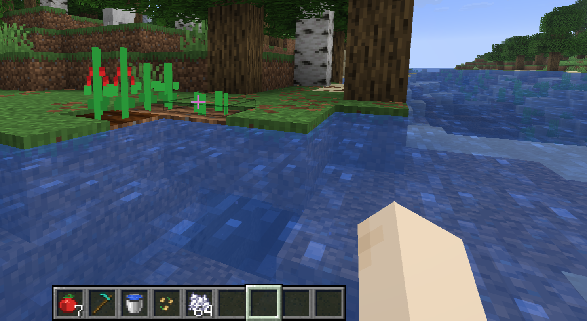
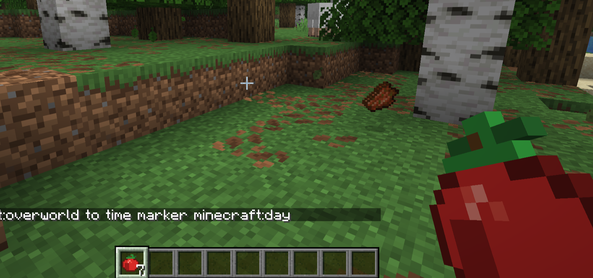

# Tomatazo 🍅

Tomatazo es un mod de Minecraft hecho con Fabric que añade una nueva mecánica completa alrededor del cultivo y uso de tomates.

## Características

- Añade semillas de tomate.
- Las semillas pueden aparecer en cofres de aldeas.
- Permite plantar y cultivar tomates.
- El cultivo crece como otros cultivos normales.
- Al cosechar un cultivo maduro, suelta tomates y semillas.
- El tomate puede comerse.
- Con Shift + clic derecho, el tomate se lanza como proyectil.
- Si el tomate impacta en la parte alta de una entidad, aplica efectos durante unos segundos.
- Añade texturas, modelos y nombres personalizados.
- Integra el tomate en la pestaña de comida del inventario creativo.

## Mecánicas principales

### Obtención

Las semillas de tomate pueden aparecer en cofres de aldeas. Esto permite conseguirlas de forma natural durante la exploración.

### Cultivo

Las semillas se pueden plantar en tierra arada. El cultivo puede crecer con el tiempo o usando polvo de hueso.

### Cosecha

Al romper un cultivo maduro, se obtienen tomates y semillas para seguir cultivando.

### Uso del tomate

El tomate tiene dos usos:

- Clic derecho normal: comer.
- Shift + clic derecho: lanzar como proyectil.

Si el tomate lanzado golpea a una entidad en la parte alta del cuerpo, aplica efectos durante unos segundos.

## Tecnologías usadas

- Java
- Fabric
- Gradle
- Minecraft modding
- Git y GitHub

## Estado del proyecto

La funcionalidad principal está terminada. El mod incluye obtención, cultivo, comida, proyectil, efectos y pulido visual básico.

## Autor

Proyecto creado por Pablxmvrtiinez como práctica de programación Java y modding de Minecraft.

## Capturas

### Cultivo y semillas de tomate

### Tomate lanzado

